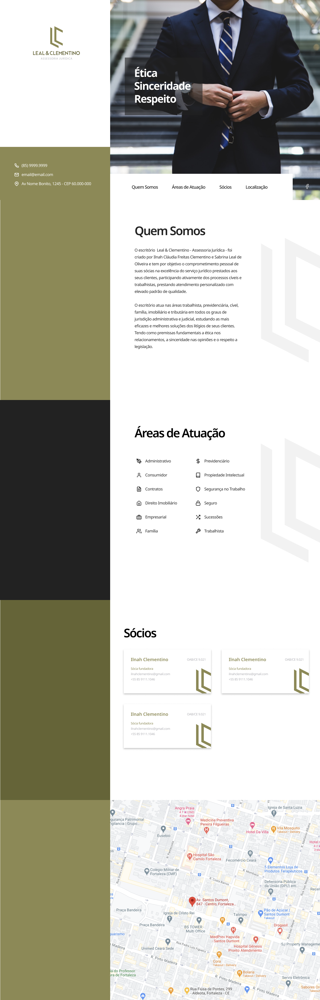

# Leal & Clementino - Assessoria Jurídica's website (2021)

## Description

Leal & Clementino - Assessoria Jurídica's Website.

Frontend Development - Static landing page.


## Features

- [SASS](https://sass-lang.com/) ready
- [Webpack](https://webpack.js.org/) ready
- [Include-media](https://github.com/eduardoboucas/include-media) ready
- Minimized JS bundle on build
- Minimized CSS bundle on build
- Optmized Images on build
- Hot reload on dev


## Stack

- HTML (Handlebars)
- CSS (SASS)
- Vanilla Javascript


## Live Demo


## Installation

1. [Install npm](https://www.npmjs.com/get-npm)
2. run `npm install yarn`
3. run `yarn install`


## How to Use

### Start frontend development

```
$ yarn start
```

### Build Project - minify HTML, CSS, JS, and optimize images

```
$ yarn build
```


## Designs

### Prototype Links

- [Desktop](https://www.figma.com/proto/d9otPaDYi5hGRlmxyMk5Sl/Leal-and-Clementino-2021?node-id=5%3A1006&viewport=489%2C118%2C0.16155555844306946&scaling=scale-down)

- [Mobile](https://www.figma.com/proto/d9otPaDYi5hGRlmxyMk5Sl/Leal-and-Clementino-2021?node-id=257%3A0&viewport=-93%2C54%2C0.43299582600593567&scaling=scale-down)


### Screenshots

#### Phone


#### Tablet


#### Desktop


